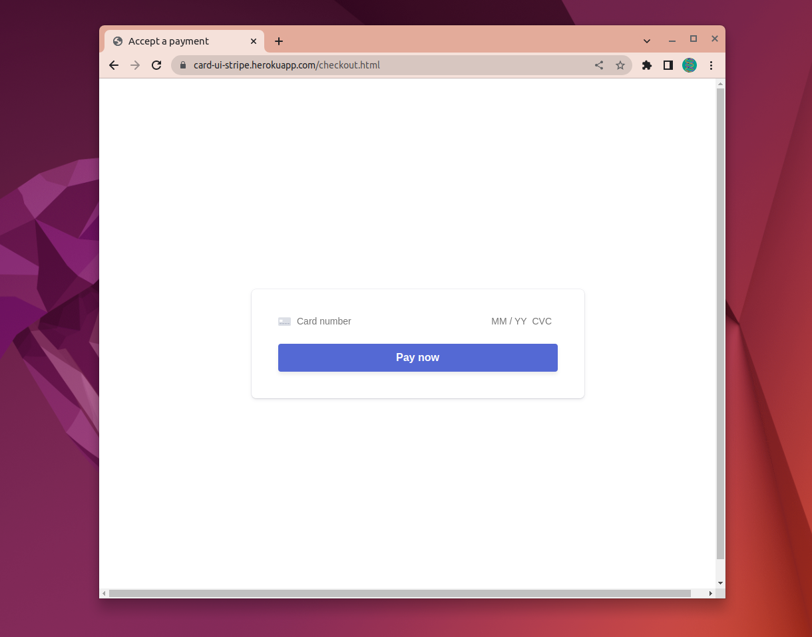
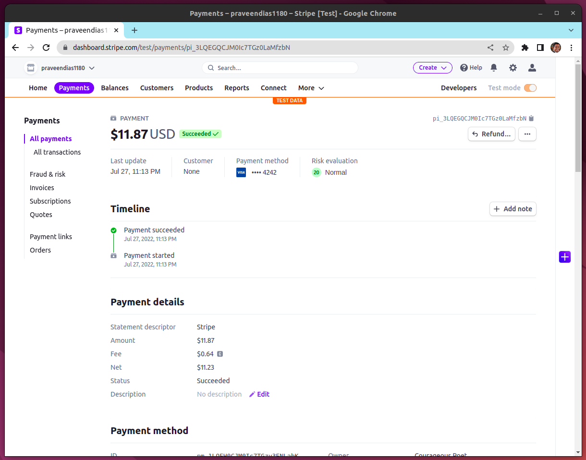
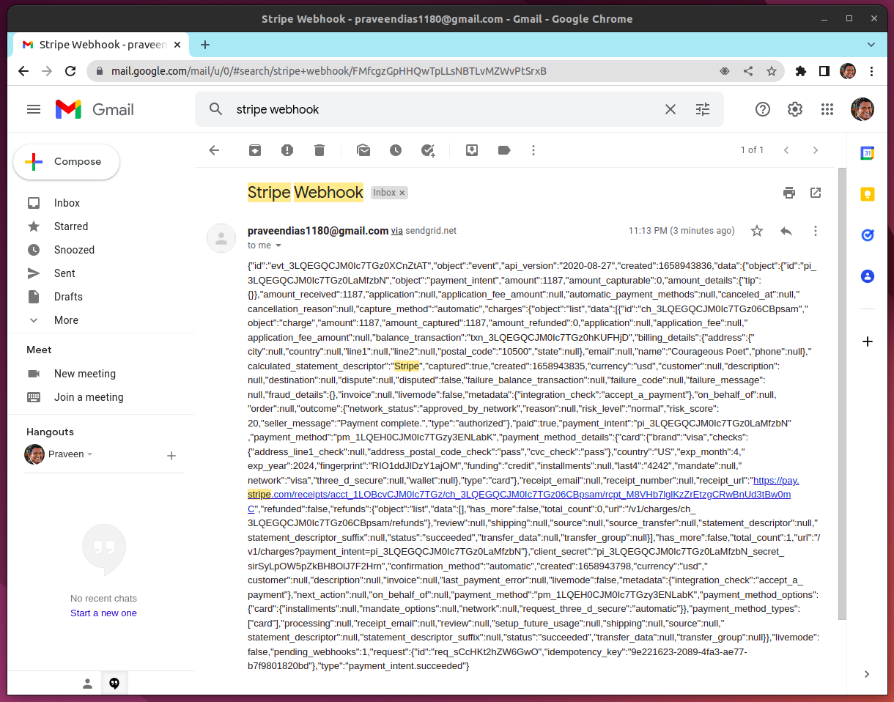
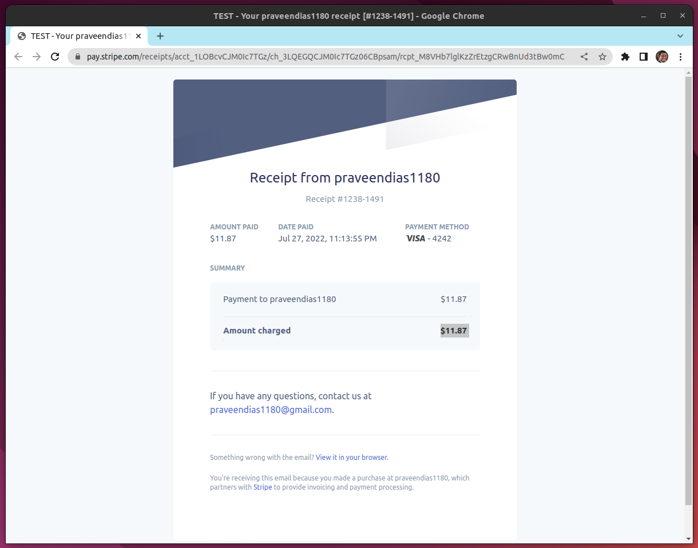

# Accept a Payment with Stripe

Build a simple checkout form to collect payment details. Included are some basic
build and run scripts you can use to start up the application.

## Running the sample

1. Build the server

~~~
npm install
~~~

2. Run the server

~~~
npm start
~~~

3. Go to [http://localhost:4242/checkout.html](http://localhost:4242/checkout.html)

# Demo Images

# Demo Video

https://youtu.be/rjkVDGTbPoY